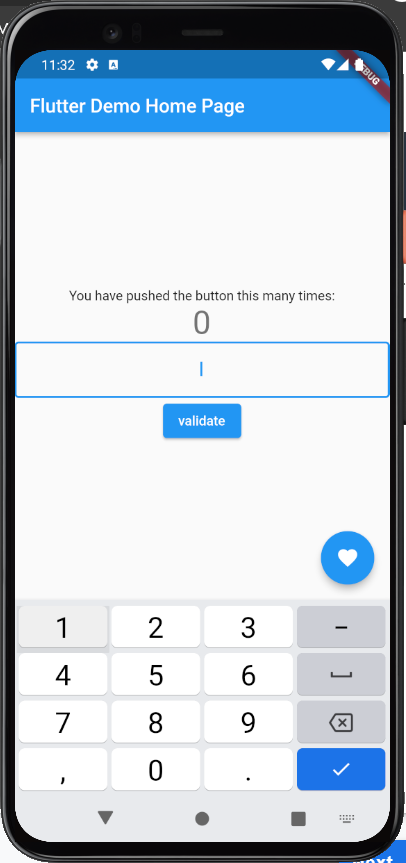

# flutter_fundamental_t8

A new Flutter project.

-- Praktikum 1

Penjelasan :
    1. on Tap() : akan bertambah 1 angka apabila diklik 1 kali pada gambar atau button.
    
    2. onDoubleTap() : akan bertambah 1 angka apabila diklik 2 kali pada gambar atau button.

    3. onLongPress() : akan bertambah 1 angkaapabila diklik dan ditahan pada gambar atau button.

-- Praktikum 2

-- Praktikum 3

